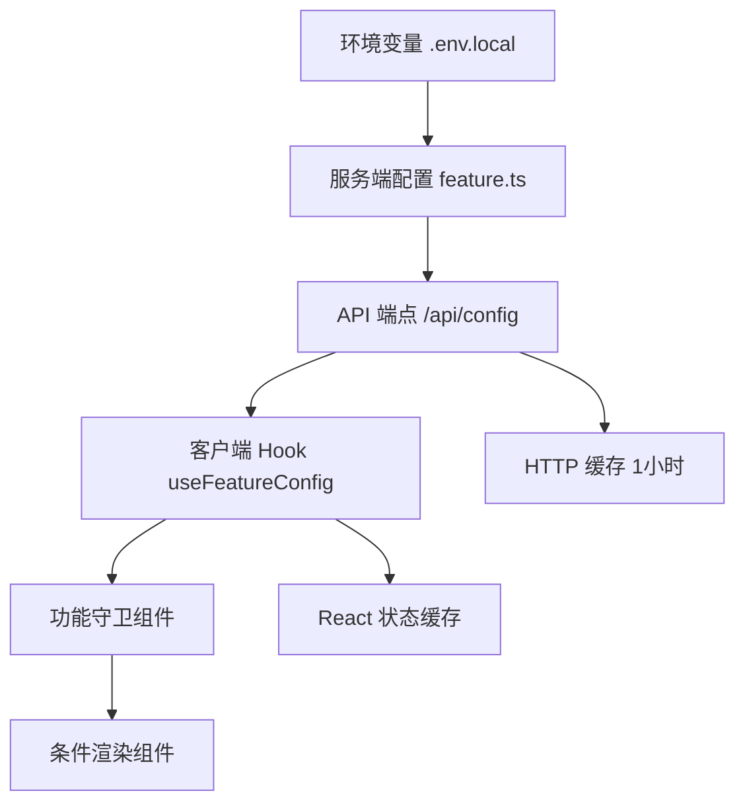

# 基于 API 的功能开关系统 - 实施总结

## 🎯 目标达成
✅ **环境变量隔离**：客户端无法直接访问环境变量  
✅ **API 安全获取**：通过 `/api/config` 端点获取功能配置  
✅ **组件化守卫**：提供通用和专用的功能守卫组件  
✅ **性能优化**：支持缓存和条件渲染  
✅ **类型安全**：完整的 TypeScript 类型支持  

## 🏗️ 架构设计



## 📁 核心文件结构

```
src/
├── config/
│   └── feature.ts                    # 服务端功能配置
├── app/api/
│   └── config/route.ts              # 配置 API 端点
├── hooks/
│   └── use-feature-config.ts        # 客户端配置 Hook
├── components/
│   ├── auth/
│   │   └── auth-wrapper.tsx         # 认证包装器
│   └── common/
│       └── feature-guard.tsx        # 通用功能守卫
└── app/[locale]/
    └── dirs/page.tsx                # 功能状态调试页面
```

## 🔧 环境变量配置

```bash
# .env.local (仅服务端可见)
FEATURE_AUTH_ENABLED=true
FEATURE_STRIPE_ENABLED=true
FEATURE_SOCIAL_AUTH_ENABLED=true
FEATURE_DOCS_ENABLED=true
FEATURE_BLOG_ENABLED=true
FEATURE_SUBMISSION_ENABLED=true
```

## 🚀 使用方式

### 1. 通用功能守卫
```typescript
import { FeatureGuard } from "@/components/common/feature-guard";

<FeatureGuard 
  feature="auth" 
  fallback={<div>功能未启用</div>}
  showLoading={true}
>
  <UserComponent />
</FeatureGuard>
```

### 2. 预定义守卫组件
```typescript
import { AuthGuard, StripeGuard } from "@/components/common/feature-guard";

<AuthGuard>
  <UserNav />
</AuthGuard>

<StripeGuard>
  <PricingSection />
</StripeGuard>
```

### 3. 直接使用 Hook
```typescript
import { useFeatureConfig } from "@/hooks/use-feature-config";

const { config, loading, error } = useFeatureConfig();

if (loading) return <Spinner />;
if (error) return <ErrorMessage />;

return (
  <div>
    {config?.auth && <AuthSection />}
    {config?.stripe && <PricingSection />}
  </div>
);
```

### 4. 服务端页面控制
```typescript
import { featureConfig } from "@/config/feature";
import { notFound } from "next/navigation";

export default function PricingPage() {
  if (!featureConfig.stripeEnabled) {
    notFound();
  }
  return <PricingSection />;
}
```

## 🔒 安全性优势

1. **环境变量隔离**
   - 客户端无法访问服务端环境变量
   - 敏感配置完全隔离

2. **API 访问控制**
   - 可以添加权限验证
   - 支持用户级功能控制

3. **降级策略**
   - API 失败时有默认配置
   - 错误状态友好处理

## ⚡ 性能优化

1. **HTTP 缓存**
   ```typescript
   headers: {
     'Cache-Control': 'public, max-age=3600', // 1小时缓存
   }
   ```

2. **React 状态缓存**
   - Hook 中的状态会被 React 缓存
   - 避免重复 API 调用

3. **条件渲染**
   - 功能未启用时不渲染组件
   - 减少包体积和运行时开销

## 🛠️ 调试工具

访问 `/dirs` 页面查看：
- 所有功能模块的启用状态
- 实时配置数据
- API 调用状态
- 错误诊断信息

## 🚀 扩展能力

### 1. 用户级功能控制
```typescript
export async function GET(request: NextRequest) {
  const userId = await getUserId(request);
  const userFeatures = await getUserFeatures(userId);
  
  return NextResponse.json({
    features: {
      ...globalFeatures,
      ...userFeatures, // 用户特定功能
    },
  });
}
```

### 2. A/B 测试支持
```typescript
export function useFeatureConfig() {
  const experimentGroup = useExperimentGroup();
  const adjustedConfig = adjustForExperiment(config, experimentGroup);
  return { config: adjustedConfig, loading, error };
}
```

### 3. 实时配置更新
```typescript
// WebSocket 或 Server-Sent Events
useEffect(() => {
  const eventSource = new EventSource('/api/config/stream');
  eventSource.onmessage = (event) => {
    const newConfig = JSON.parse(event.data);
    setConfig(newConfig.features);
  };
}, []);
```

## 📋 部署清单

- [ ] 环境变量正确设置
- [ ] `/api/config` 端点可访问
- [ ] 缓存策略配置
- [ ] 错误监控设置
- [ ] 功能状态验证

## 🔍 监控指标

建议监控以下指标：
- `/api/config` 调用频率
- API 响应时间
- 错误率
- 缓存命中率

## 🎉 优势总结

1. **安全性**：环境变量不暴露给客户端
2. **灵活性**：支持运行时配置和扩展
3. **性能**：缓存策略和条件渲染优化
4. **开发体验**：类型安全和调试工具
5. **可维护性**：清晰的架构和组件化设计

这个系统为您的项目提供了一个安全、高效、可扩展的功能开关解决方案！🚀 